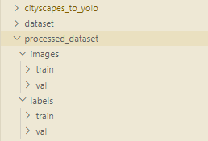
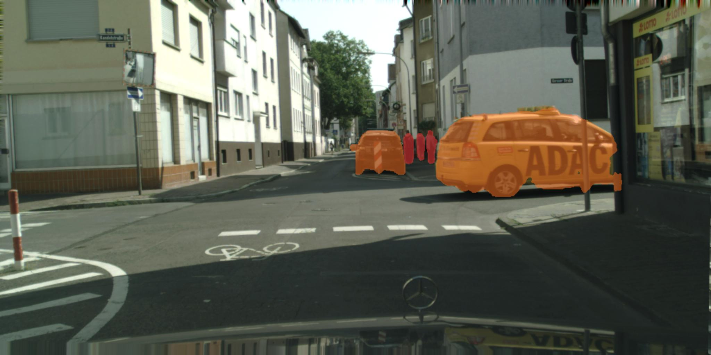
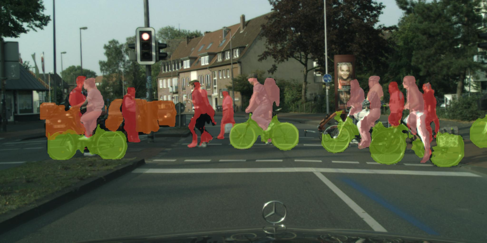
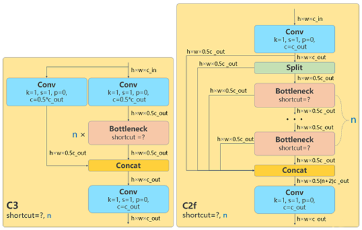
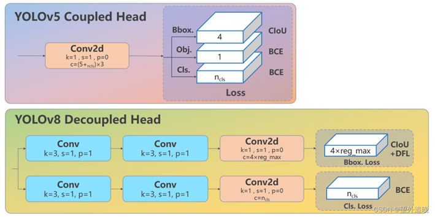
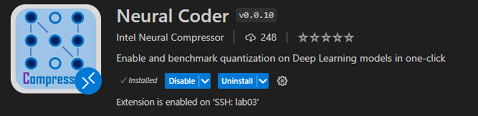
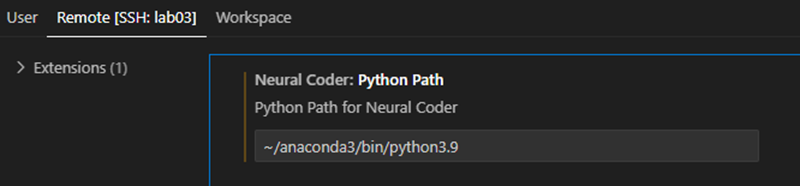
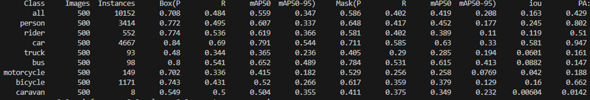
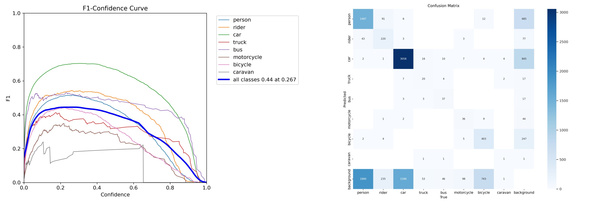
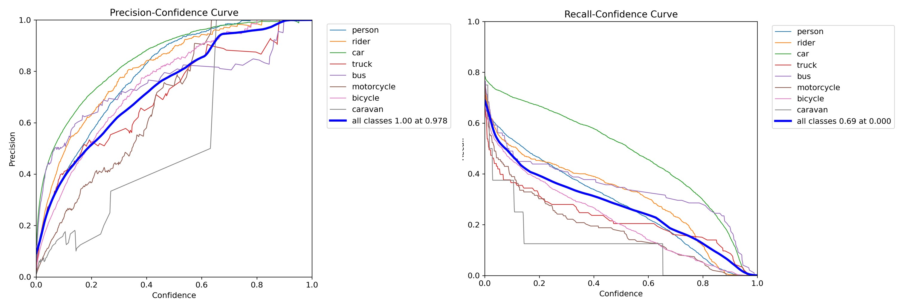

# 基于Yolo的自动驾驶车辆的对象检测

## 问题描述

&emsp;&emsp;使用计算机视觉技术和英特尔® AI 分析工具套件为自动驾驶车辆开发实时对象检测模型。参赛团队需要创建一个深度学习模型，用于准确检测行人、车辆、交通标志和交通信号等对象。该模型需要具有高准确度和低延迟，能够满足自动驾驶车辆安全导航的需求。
## oneAPI
&emsp;&emsp;英特尔oneAPI是英特尔公司推出的一个软件开发工具套件，旨在为多种计算设备（包括CPU、GPU、FPGA等）提供统一的、跨平台的编程模型。它旨在解决现有异构计算环境下的应用开发和优化难题，使开发人员能够更高效地利用各种硬件资源。
#### oneAPI的主要组成

- **DPC++编译器**: DPC++是oneAPI中的主要编程语言，它基于C++并扩展了SYCL（单指令多数据并行编程模型），支持异构计算设备的编程。DPC++编译器能够将编写的代码翻译为硬件可执行的指令，以实现高性能计算。
- **oneDNN(oneAPI Deep Neural Network Library)**：一个高性能的深度学习推理库，提供了一系列优化算法和函数，以加速深度神经网络的推理过程。
- **oneCCL(oneAPI Collective Communications Library)**：一个用于并行计算的通信库，提供了一套高效的集体通信操作接口，可以实现在多个计算设备之间的数据交换和同步。
- **oneTBB(oneAPI Threading Building Blocks)**：一个用于并行编程的库，提供了丰富的线程和任务管理功能，能够帮助开发人员更好地利用多核处理器的并行能力。
- **oneMKL(oneAPI Math Kernel Library)**:一个数学函数库，提供了一系列高性能的数值计算和线性代数操作函数，可用于加速科学计算、数据分析等应用


## 代码执行

环境：

- 下载代码仓库：

```
git clone git@github.com:Perter-Li/cityscapesSeg.git
```

安装依赖：

```
pip install -r requirements.txt
```


- 数据集下载：

​			本次项目采用的数据集由oneAPI官方指定，为[cityscapes城市景观数据集](https://www.cityscapes-dataset.com/)，包含了高清城市场景图像用于语义分割任务。其中我们选取了`gtFine_trainvaltest`和`leftImg8bit_trainvaltest`两类数据用于训练和测试，里面分别包括了30类对象（行人、摩托车、卡车、汽车、桥、围栏等）的1525和5000幅图像。如下图所示：

关于数据集如何进行下载，可参考博客：[cityscapes数据集的下载和应用](https://blog.csdn.net/zisuina_2/article/details/116302128)


- 数据格式转换：

```
cd cityscapes_to_yolo/
python main.py --datadir path_to_cityscapes_dataset --savedir path_to_processed_dataset_dir
```

其中`path_to_cityscapes_dataset`为cityscapes数据集的路径，而`path_to_processed_dataset_dir`则代表最终想要将处理好的数据以及标签存储的位置。

当执行成功以后，将生成转换后的数据格式。

&emsp;&emsp; 


- 数据训练：

```
python train.py
```


- 数据结果预测：

```
python predict.py
```

在这里可以传入一张数据图像，根据我们的当前已训练好的模型，将可以得到预测的结果：





注：倘若想要更详细地查看模型结构，可以执行`run.ipynb`中的代码。


## 数据集介绍及处理

- 原数据集        

本次项目采用的数据集由oneAPI官方指定，为`cityscapes`城市景观数据集，包含了高清城市场景图像用于语义分割任务。其中我们选取了`gtFine_trainvaltest`和`leftImg8bit_trainvaltest`两类数据用于训练和测试，里面分别包括了30类对象（行人、摩托车、卡车、汽车、桥、围栏等）的1525和5000幅图像。   
        

- 数据集转换        

   由于我们采用了`yolov8n`作为基础模型，城市景观数据集需要转换为`yolo`数据集格式才能使用。Yolo标注格式如下所示：        

  ```
  <object-class> <x> <y> <width> <height>
  ```

1. object-class: 对象的标签索引    

2. x, y: 目标的中心坐标，相对于图片的H和W做归一化。即x/W, y/H    

3. width, height: 目标（bbox）的宽和高    

   例如：    

   ```
   0 0.412500 0.318981 0.358333 0.636111
   ```

&emsp;&emsp; 我们首先对城市数据景观数据集标签格式转成`coco`数据集格式，然后对所有图像进行了归一化处理，以便网络模型能够更好地处理图像数据，最后再将其转为yolo格式。    


- 数据集 coco->yolo的转换：        

1. 创建image-dict        

    <details><summary> 代码块展开 </summary> 
    
        # Import json
        for json_file in sorted(Path(json_dir).resolve().glob('*.json')):
            fn = Path(save_dir) / 'labels' / json_file.stem.replace('instances_', '')  # folder name
            fn.mkdir()
            with open(json_file) as f:
                data = json.load(f)
            # Create image dict
            images = {'%g' % x['id']: x for x in data['images']}
            # Create image-annotations dict
            imgToAnns = defaultdict(list)
            for ann in data['annotations']:
                imgToAnns[ann['image_id']].append(ann)    
    
    
    
2. 对图像进行归一化处理并转换为yolo格式        
   <details><summary> 代码块展开 </summary> 
   
        # Write labels file
        for img_id, anns in tqdm(imgToAnns.items(), desc=f'Annotations {json_file}'):
           img = images['%g' % img_id]
           h, w, f = img['height'], img['width'], img['file_name']
           file_dir = os.path.join(*(f.split('/')[1:-1]))
           filename = f.split('/')[-1]
           bboxes = []
           segments = []
           for ann in anns:
               if ann['iscrowd']:
                   continue
               # The COCO box format is [top left x, top left y, width, height]
               box = np.array(ann['bbox'], dtype=np.float64)
               box[:2] += box[2:] / 2  # xy top-left corner to center
               box[[0, 2]] /= w  # normalize x
               box[[1, 3]] /= h  # normalize y
               if box[2] <= 0 or box[3] <= 0:  # if w <= 0 and h <= 0
                   continue
               cls = coco80[ann['category_id'] - 1] if cls91to80 else ann['category_id'] - 1  # class
               box = [cls] + box.tolist()
               if box not in bboxes:
                   bboxes.append(box)
               # Segments
               if use_segments:
                   if len(ann['segmentation']) > 1:
                       s = merge_multi_segment(ann['segmentation'])
                       s = (np.concatenate(s, axis=0) / np.array([w, h])).reshape(-1).tolist()
                   else:
                       s = [j for i in ann['segmentation'] for j in i]  # all segments concatenated
                       s = (np.array(s).reshape(-1, 2) / np.array([w, h])).reshape(-1).tolist()
                   s = [cls] + s
                   if s not in segments:
                       segments.append(s)
   
    
   
3. 最后将标签数据保存为txt文件        
        
    <details><summary> 代码块展开 </summary> 
    
        subdir=os.path.join(fn,file_dir)
        if not os.path.exists(subdir):
            os.makedirs(subdir)
            
        # 修改文件名后缀
        outfilename = filename.split(".")[0] + ".txt"
        # Write
        with open(os.path.join(fn,file_dir,outfilename), 'a') as file:
            for i in range(len(bboxes)):
                line = *(segments[i] if use_segments else bboxes[i]),  # cls, box or segments
                file.write(('%g ' * len(line)).rstrip() % line + '\n')
    
    
    
    

&emsp;&emsp;以上便是数据集格式的转变方式，通过调用上述函数，将路径名做简单的修改便可以对不同数据集进行格式转换。   
&emsp;&emsp;最终处理完成的数据集只包含image和label，如下所示：      
&emsp;&emsp;  
    


# Yolo模型介绍及改进        

&emsp;&emsp; 模型上，由于`yolo`属于单阶段`(1-stage)`检测模型，能够使用单一网络便同时完成定位与分类，具有简洁、高效、速度快的特性，且具有不错的识别效果。因此，我们采用`yolo`的改进版本**yolov8n**作为我们的基础模型。`yolov8`是` ultralytics `公司在 2023 年 1月 10 号开源的 YOLOv5 的下一个重大更新版本，它不仅支持图像分类，还支持物体检测和实例分割任务。由于其是基于yolo进行改进，它具有单阶段模型所具有的推理速度快的特性，并且能够有较高的准确度。      `yolov8 `基于 **Backbone、PAN-FPN、Decoupled-Head、Anchor-Free、损失函数、样本匹配 **这几个模块进行了改进。模型的 **Backbone、Decoupled-Head、匹配策略、损失函数** 采用了如下方法：    

- **Backbone**: 这里使用的仍然是CSP的思想，不过将C3模块替换成了`C2f`模块（block数从3-6-9-3改为3-6-6-3），增加了更多的跳跃连接和split操作，实现了进一步的轻量化，同时也保留了SPPF模块。    
   
  
- **Decoupled-Head**：从耦合头变为了解耦头，分类和回归分为两个分支分别进行；这源于YoloX，即分类与回归两个任务的head不再共享参数        
        
  
- **匹配策略**：这里正负样本匹配策略采用的是Task-Aligned Assigner，也即对齐分配器，公式如下：        
  $$ t=s^\alpha \cdot u^\beta $$  
  
  - 其中，s是GT的预测分值，u是预测框和GT Box的iou，$\alpha$和$\beta$为权重超参数，两者相乘就可以衡量对齐程度，当Cls的分值越高且IOU越高时，t的值就越接近于1
  
- **损失函数**：损失函数包括两个分支，CIs与Box Reg；其中分类损失采用了BCE损失:        
  
  $loss(y, \hat{y}) = -\frac{1}{n} \sum_i\big[{(y^{(i)} \log \hat{y}^{(i)}) + (1 -y^{(i)}) \log(1 -\hat{y}^{(i)})}\big]$
  
  而位置损失分为了两个部分：CIou_Loss + Distribution Focal Loss；第一部分是计算预测框与目标框之间的IOU，这里采用了CIou Loss，第二部分采用DFL；   
  
  $DFL(S_i, S_{i+1})= -\big[(y_{i+1} - y)\log(S_i) + (y-y_i)\log(S_{i+1})\big]$     
  
  - DFL 能够让网络更快地聚焦于目标y附近的值，增大它们的概率。        
        
### 利用oneAPI里的Pytorch扩展 Intel(R) Extension for Pytorch 训练        

&emsp;&emsp; Intel(R) Extension for Pytorch 针对命令模式（imperative mode)和图模式进行了优化，并针对Pytorch的三个关键模块：运算符、图和运行时 进行了优化，优化的运算符和内核通过 PyTorch 调度机制完成调用。在执行期间，面向 PyTorch* 的 Intel扩展将用扩展中优化的运算符覆盖 ATen 运算符的对应部分，并为常见的用例提供一组额外的自定义运算符和优化实现。在图模式下，扩展进一步应用图优化，以最大限度地提升内核的执行性能。运行时优化封装在运行时扩展模块中，该模块可为用户提供几个 PyTorch 前端 API，以便对线程运行时进行更精细化的控制。           
&emsp;&emsp;IPEX的使用非常方便，仅仅只需一条指令便能够完成模型优化：        

```
import intel_extension_for_pytorch as ipex
self.model, self.optimizer) = ipex.optimize(self.model, optimizer=self.optimizer)
```
&emsp;&emsp;我们首先找到ultralytics源码中的BaseTrainer，在进行训练之前将模型和优化器传入ipex中进行优化，并用返回的model和optimizer进行训练        
        
### 利用Neural Compressor工具训练

&emsp;&emsp; Intel(R) Neural Compressor是一个用于模型压缩的开源 Python 包。该库可应用于 CPU 或 GPU 上的深度学习部署，以减小模型大小并加快推理速度。此外它为著名的网络压缩技术提供统一的用户界面，包括跨各种深度学习框架的量化、修剪和知识蒸馏。该工具的自动精度驱动调整技术可用于生成最佳量化模型。此外，它允许知识蒸馏，以便可以将来自教师模型的知识转移到学生模型中。它实现了几种权重剪枝方法，以使用预定的稀疏目标生成剪枝模型。
&emsp;&emsp;neural compressor的安装：
```
pip install neural-compressor -i https://pypi.tuna.tsinghua.edu.cn/simple/
```
&emsp;&emsp;neural compressor的使用也比较方便，我们采用了quantization.fit()函数以尝试利用 Intel(R) Neural Compressor对模型进行量化：
```
conf = PostTrainingQuantConfig(backend='ipex',
                                accuracy_criterion = AccuracyCriterion(
                                    higher_is_better=True, 
                                    criterion='relative',  
                                    tolerable_loss=0.01))
            
self.model = quantization.fit(self.model,
                conf,
                calib_dataloader=self.train_loader,
               eval_func=self.eval_func
                )
```
### Neural-Coder————Visual Studio Code Extension
&emsp;&emsp;为了进一步简化开发者的开发流程，Intel推出了一款一键式、无代码解决方案 Intel(R) Neural Coder。 Neural Coder是Neural Compressor下的新组件，通过一键式设备切换和优化启动自动代码更改，无需在深度学习脚本中进行基于CUDA的硬编码便可以进一步简化深度学习模型的部署。这一组件不仅可以优化这些脚本的性能，还能针对这些优化进行基准测试，进而提供合适的部署方案。        
&emsp;&emsp; Neural Coder采用了静态程序分析技术和启发式优化规则，简化各种深度学习优化api的使用，以提高AI模型的计算效率，改善一般AI客户的用户体验。      Neural-Coder的使用方式通常有以下三种：**Jupyter Lab Extension/Visual Studio Code Extension、Python Launcher、Python API**，这里我们采用了VSCode Extension的方式：       

1. 在服务器安装Neural-Coder：  
           
   &emsp;&emsp;         
2.  设置路径：            
           
   &emsp;&emsp;         
3. . 最后在代码右上角图标中选择INC Auto Enable Benchmark运行程序    


# 模型性能        

### oneAPI加速性能        

|      | 训练时间     | 加速比     |
| -------- | -------- | -------- |
| 初始模型 | 25h 45min 40s | 1.12 |
| 使用oneAPI后的模型 | 22h 47min 6s | 1 |

### 运行结果        

- 最终运行结果如下图：        
     
        
  
- 我们选取了8个类别，并分别绘制了他们的F1-Confidence曲线和混淆矩阵：  
  
    
  Precision-Recall 曲线以及Recall-Confidence 曲线：       
  &emsp;&emsp;
  
- 模型对单张图片的平均验证时间：
        
| preprocess time     | inference     | postprocess time     |
| -------- | -------- | -------- |
| 0.5ms | 2.2 ms | 0.6 ms |


# 参考资料
1. [面向 PyTorch* 的英特尔® 扩展助力加速 PyTorch](https://blog.csdn.net/gc5r8w07u/article/details/125389242)        
2. [目标检测任务中常用的数据集格式(voc、coco、yolo)](https://blog.csdn.net/weixin_45277161/article/details/130331788)     
3. [YOLOv8 网络结构-拆解与组装](https://zhuanlan.zhihu.com/p/628313867?utm_id=0)    
4. [YOLOv8详解代码实战，附有效果图](https://betheme.net/qianduan/118572.html?action=onClick)    
5. [简单了解YOLOv8](https://blog.csdn.net/w15136756855/article/details/131927411)    
